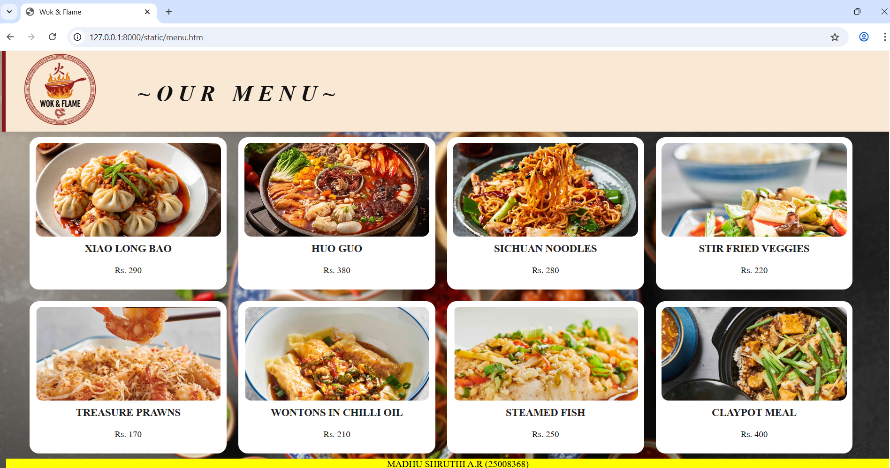

# Ex.06 Restaurant Website
## Date: 17-12-2025

## AIM:
To develop a static Restaurant website to display the food items and services provided by them.

## DESIGN STEPS:

### Step 1:
Requirement collection.

### Step 2:
Creating the layout using HTML and CSS.

### Step 3:
Updating the sample content.

### Step 4:
Choose the appropriate style and color scheme.

### Step 5:
Validate the layout in various browsers.

### Step 6:
Validate the HTML code.

### Step 7:
Publish the website in the given URL.

## PROGRAM:
 ```
 restaurant.html
 <html>
<head>
    <title>Wok & Flame</title>
    <link href="style.css" rel="stylesheet">
</head>
<body>
    <div class="container">
        <h2 class="restaurant-name">WOK & FLAME</h2>

        <div class="logo-box">
            
        </div>
        <div class="items">
            <a href="restaurant.htm">HOME</a>
            <a href="menu.htm"> MENU</a>
            <a href="admin.htm"> ADMINISTRATION</a>
            <a href="contact.htm">CONTACT</a>
        </div>
        <div class="content">
            <h1>FROM THE HEART OF CHINA TO YOUR TABLE!</h1>
        </div>
    </div>
<footer class="footer">
 <p> MADHU SHRUTHI A.R (25008368) </p>
</footer>
</body>
</html>

style.css

body {
    background-image: url(bg3.png);  
    background-repeat: no-repeat;  
    background-size: cover;
    height: 200px;
    position: relative;
}
.content{
    position: absolute;
    top: 200px;
    text-align: center;
    color: rgb(255, 255, 255);
    top: 270px;
    left: -38px;
    font-weight: bold;
    font-size: 42px;
}
.content{
    text-shadow: 3px 3px 0 #d94718;
}
.container {
    width: 1540px;
    height: 140px;
    background: rgb(249, 232, 211);
    padding: 1px;
    margin: 30px auto;             
    box-shadow: 0px 0px 12px rgba(0,0,0,0.15);
    text-align: center; 
    position: relative;
    bottom: 15px; 
    border-left: 7px solid rgb(135, 24, 24);             
}
.restaurant-name {
    font-size: 38px;
    font-weight: bolder;
    color: rgb(18, 18, 18);                
    margin-bottom: 20px;
    font-style: oblique;
    letter-spacing: 10px;
    position: absolute;
    right: 970px;
    top: 30px;  
}
.logo-box {
    margin-bottom: 50px;
}
.logo {
    width: 125px;                
    height: auto;
    position: absolute;
    left: 30px;
    bottom: 10px;
}
.items 
{
    position: absolute;
    left : 850px;
    justify-content: space-between;
    bottom: 45px;
    gap: 500px;
    word-spacing: 45px;
    font-size: 20px;
    font-display: block;
    font-weight: 550;
    font-style: oblique;
}
.items a{
    color : rgb(19, 19, 19);
    text-decoration: none;
}
.items a:hover{
    color: maroon;
    cursor: pointer;
}

footer{
    text-align: center;
    position: relative;
    top: 490px;
    background-color: yellow;
}
 ```

 ```
 menu.html

 <html>
    <head>
     <title>Wok & Flame</title>
    <link href="menu.css" rel="stylesheet">
</head>
<body>
    <div class="container">
        <div class="logo-box">
            
        </div>

  <h1 class="menu">~OUR MENU~</h1>

  <div class="food-container">

    <div class="food-card">
      
      <h3>XIAO LONG BAO</h3>
      <p>Rs. 290</p>
    </div>

    <div class="food-card">
      
      <h3>HUO GUO</h3>
      <p>Rs. 380</p>
    </div>

    <div class="food-card">
      
      <h3>SICHUAN NOODLES</h3>
      <p>Rs. 280</p>
    </div>

    <div class="food-card">
      
      <h3>STIR FRIED VEGGIES</h3>
      <p>Rs. 220</p>
    </div>

    <div class="food-card">
      
      <h3>TREASURE PRAWNS</h3>
      <p>Rs. 170</p>
    </div>

    <div class="food-card">
      
      <h3>WONTONS IN CHILLI OIL</h3>
      <p>Rs. 210</p>
    </div>

    <div class="food-card">
      
      <h3>STEAMED FISH</h3>
      <p>Rs. 250</p>
    </div>

    <div class="food-card">
      
      <h3>CLAYPOT MEAL</h3>
      <p>Rs. 400</p>
    </div>

  </div>
  <footer class="footer">
 <p> MADHU SHRUTHI A.R (25008368) </p>
</footer>
</body>
</html>

menu.css

body {
    background-image: url(bg3.png);  
    background-repeat: no-repeat;  
    background-size: cover;
    position: relative;
    backdrop-filter: blur(2px);
}
.container {
    width: 1540px;
    height: 140px;
    background: rgb(249, 232, 211);
    padding: 1px;
    margin: 30px auto;             
    box-shadow: 0px 0px 12px rgba(0,0,0,0.15);
    text-align: center; 
    position: relative;
    bottom: 15px; 
    border-left: 7px solid rgb(135, 24, 24);             
}
.menu{
    font-size: 38px;
    font-weight: bolder;
    color: rgb(18, 18, 18);                
    margin-bottom: 20px;
    font-style: oblique;
    letter-spacing: 10px;
    position: absolute;
    right: 970px;
    top: 30px;  
}
.logo-box {
    margin-bottom: 50px;
}
.logo {
    width: 125px;                
    height: auto;
    position: absolute;
    left: 30px;
    bottom: 10px;
}

.food-container {
  margin-left: 40px;
  margin-right: 40px;
  margin-bottom: 50px;
  margin-top: 20px;

  display: grid;
  grid-template-columns: 23% 23% 23% 23%;
  gap: 20px;
}
.food-container{
    position: relative;
    top:100px;
}
.food-card {
  background: rgb(255 255 255);
  backdrop-filter: blur(6px);
  border-radius: 16px;
  padding: 10px;
  text-align: center;
  height: 240px;
}

.food-card img {
  width: 100%;
  height: 160px;
  object-fit: cover;
  border-radius: 12px;
}

.food-card h3 {
  margin-top: 10px;
  font-size: 18px;
  color: #222;
}

.food-card p {
  margin-top: 6px;
  font-size: 15px;
  color: #181818;
}

footer{
    text-align: center;
    position: relative;
    top: 42%;
    background-color: yellow;
}
 ```
```
admin.html

<html>
<head>
    <title>Wok & Flame</title>
    <link href="admin.css" rel="stylesheet">
</head>
<body>
    <div class="container">
        <h2 class="admin">~OUR ADMINISTRATION TEAM~</h2>

        <div class="logo-box">
            
        </div>
    <div class="team">

        <div class="card">
            
            <h3>Madhu Shruthi A.R</h3>
            <p>CEO</p>
        </div>

        <div class="card">
            
            <h3>Ian Somerhalder</h3>
            <p>Marketing Manager</p>
        </div>

        <div class="card">
            
            <h3>Paul Wesley</h3>
            <p>Operations Manager</p>
        </div>

        <div class="card">
            
            <h3>TAYLOR Swift</h3>
            <p>HR Manager</p>
        </div>

        <div class="card">
            
            <h3>Selena Gomez</h3>
            <p>Executive Chef</p>
        </div>

        <div class="card">
            
            <h3>Rohit Sharaf</h3>
            <p>Customer Service Manager</p>
        </div>

    </div>
    <footer class="footer">
 <p> MADHU SHRUTHI A.R (25008368) </p>
</footer>

</body>
</html>

admin.css

body {
    background-image: url(bg3.png);  
    background-repeat: no-repeat;  
    background-size: cover;
    position: relative;
    backdrop-filter: blur(2px);
}
.container {
    width: 1540px;
    height: 140px;
    background: rgb(249, 232, 211);
    padding: 1px;
    margin: 30px auto;             
    box-shadow: 0px 0px 12px rgba(0,0,0,0.15);
    text-align: center; 
    position: relative;
    bottom: 15px; 
    border-left: 7px solid rgb(135, 24, 24);             
}
.admin{
    font-size: 25px;
    text-align: center;
    font-weight: bolder;
    color: rgb(18, 18, 18);                
    margin-bottom: 20px;
    font-style: oblique;
    letter-spacing: 10px;
    position: absolute;
    right: 500px;
    top: 30px;  
}
.logo-box {
    margin-bottom: 50px;
}
.logo {
    width: 125px;                
    height: auto;
    position: absolute;
    left: 30px;
    bottom: 10px;
}
.team {
    justify-content: center;
    gap: 30px;
    padding-bottom: 50px;
    position: relative;
    top: 70%;   
    display: grid;
    grid-template-columns: 23% 23% 23%;
}
.card {
    width: 250px;
    background: #fff7e6;
    border-radius: 10px;
    text-align: center;
    padding: 15px 5px;
}
.card img {
    width: 150px;
    height: 170px;
    border-radius: 10%;
    object-fit: cover;
}
.card h3 {
    margin: 15px 0 5px;
}
.card p {
    margin: 0;
    font-size: 14px;
}

footer{
    text-align: center;
    position: relative;
    top: 25%;
    background-color: yellow;
}
```

```
contact.html

<html>
<head>
    <title>Wok & Flame</title>
    <link href="contact.css" rel="stylesheet">
</head>
<body>
    <div class="container">
        <h2 class="restaurant-name">WOK & FLAME</h2>

        <div class="logo-box">
            
        </div>
        <div class="reserve">RESERVE A TABLE NOW!</div>
        
        <div class="contact">
            <div class="call">
               <h1> CONTACT US </h1>
            </div>
              <hr>
            <div class="get"> <h3>-GET IN TOUCH WITH US-</US-></h3></div>
        </div>
        <div class="box">
            <div class="phone">
                CALL US AT:
                <br>
                    <h4>+91 91 98887 93337.</h4>
            </div>
            <div class="email">
                REACH US AT:
                <br>
                <h4>woknflame@gmail.com</h4>
            </div>
            <div class="address">
                VISIT US AT:
                <br>
                <h4>Address: 14/4, AA Block 3rd Main Rd, Lapis lagoon, AB Block, Shanthi Colony, Anna Nagar, Chennai, Tamil Nadu 600040 </h4>
            </div>
        </div>
        <footer class="footer">
 <p> MADHU SHRUTHI A.R (25008368) </p>
</footer>

contact.css

body {
    background-image: url(bg3.png);  
    background-repeat: no-repeat;  
    background-size: cover;
    position: relative;
    backdrop-filter: blur(2px);
}
.content{
    position: absolute;
    top: 200px;
    text-align: center;
    color: rgb(255, 255, 255);
    top: 270px;
    left: -38px;
    font-weight: bold;
    font-size: 42px;
}
.content{
    text-shadow: 3px 3px 0 #d94718;
}
.container {
    width: 1520px;
    height: 140px;
    background: rgb(249, 232, 211);
    padding: 1px;
    margin: 30px auto;             
    box-shadow: 0px 0px 12px rgba(0,0,0,0.15);
    text-align: center; 
    position: relative;
    bottom: 15px; 
    border-left: 7px solid rgb(135, 24, 24);  
    top: -26px;           
}
.restaurant-name {
    font-size: 38px;
    font-weight: bolder;
    color: rgb(18, 18, 18);                
    margin-bottom: 20px;
    font-style: oblique;
    letter-spacing: 10px;
    position: absolute;
    right: 970px;
    top: 30px;  
}
.logo-box {
    margin-bottom: 50px;
}
.logo {
    width: 125px;                
    height: auto;
    position: absolute;
    left: 30px;
}
.reserve{
    font-size: 20px;
    text-align: right;
    position: relative;
    right: 60px;
    top: 60px;
}  
.call{
    text-align: left;
    position: relative;
    top: 70px;
    letter-spacing: 10px;
    right: 7px;
    font-weight: bolder;
    font-size: 20pt;
} 
hr{
    width: 450px;
    position: relative;
    right: 540px;
    top: 40px;
}
h3{
    position: relative;
    top: 50px;
    right: 560px;
    letter-spacing: 3px;
}
.box{
    width: 450px;
    height: auto;
    position: relative;
    top: 10px;
    padding: 20px;
}
h4{
    text-align: left;
    font-size: 20px;
}
.phone, .email, .address, .hours{
    text-align: left;
    font-size: 25px;

}
.get{
    position: relative;
    top: -19px
}
footer{
    text-align: center;
    position: relative;
    top: 1%;
    background-color: yellow;
}
```
## OUTPUT:





## RESULT:
The program for designing software company website using HTML and CSS is completed successfully.
